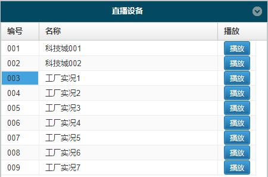

# FastWeb
WEB架構的企業級云平臺，運用托放式網站建置工具、整合物聯網與企業資源管理，無需技術背景，就能建置企業管理網站。透過最新的移動應用程式，從世界任何角落輕鬆管理。運行版僅供個人且非商業使用。

> **加入 Facebook 社團**
>
> [https://www.facebook.com/groups/isoface/](https://www.facebook.com/groups/isoface/)
> 
> **點讚追蹤 Facebook 粉絲專頁**
> 
> [https://www.facebook.com/AIOT.ERP](https://www.facebook.com/AIOT.ERP)

## FastWeb 快速開發平臺

擁有企業建構Web平臺所需的所有功能。它在實惠的價格平臺上，提供RMM遠端支援。從遠端監控管理到強大的商務管理功能，FastWeb以最少的成本，提供更多控制功能的MSP服務。它不但開發速度快、門檻低，還大幅降低企業開發 Web成本。

FastWeb是設計專業商務網站與 APP的絕佳工具，無論是首次使用的新手，或是經驗豐富的專業人士，都可以實現任何創意。它採用所見即所得之動態編輯器，提供受全方位自由設計功能，與FastWeb開發的網頁控制項，新增高級功能到網站中。建立專業的商務網站，與跨平臺之APP程式。

透過FastWeb編輯器，使用專屬控制項，只需簡單幾行程式，即可自訂建立內容豐富的商務管理網站，無需伺服器，無論您從事何種行業或職務，都可從任何地方管理、設計網站。FastWeb帶來無限可能！以輕鬆的方法線上上發展事業。簡單而言使用 FastWeb，就能自由創作，完全自行設計商務網站。

## 七大優勢

1. 低開發成本、軟體採用無限授權，購置費用低廉
2. 自訂設計開發效率高、快速完成專案開發
3. 學習時間短
4. 功能強大、擴充套件性強
5. 安全性與穩定性
6. 即時控制與監測
7. 採用雲端的佈署策略

## FastWeb 線上試用

FastWeb 暫不提供社區版試用，您可以直接通過 Web 頁面來試用、體驗功能。

### 演示測試

點選 [演示測試鏈接](https://web.diylogi.com/) 進入登錄頁面后，再依序鍵入登錄資訊。演示測試只能看到執行的效果，無法使用程式開發與系統管理功能。

演示測試鏈接使用的登錄資訊

使用者名稱：demo

密碼：demo

### 開發測試

點選 [開發測試鏈接](https://web.diylogi.com/?logintype=1) 進入登錄頁面后，再依序鍵入登錄資訊。開發測試可使用 IDE 界面設計、瀏覽系統管理功能，修改結果不能儲存。

開發測試鏈接使用的登錄資訊

使用者名稱：test

密碼：test

### 檢視模組開發界面

* 使用開發測試登錄
* 點選功能表欄中的`系統工具-模組列表(Web)` 或 `系統工具-模組列表(App)`
* 在打開的模組列表中選擇要檢視的模組，點選`模組設計`
* 開啟對應的模組設計界面，在界面中可檢視模組的界面設計與程式。

詳情請檢視[FastWeb快速上手](https://isoface.net/isoface/doc/fastweb/quick-start/)。

## FastWeb 特色模組

**任務管理系統主頁**：

打開方式：進入系統后，點選`工商管理範例-任務管理-任務管理系統主頁`，打開主頁，可直接進行相關數據的檢視。

在此頁面下，可點選圖表欄上側的圖表型別(柱狀圖、折線圖)、檢視數據時間範圍(最近7天、最近14天、最近30天)來檢視特定狀態的圖表資訊。

**超融合戰情室**：

打開方式：進入系統后，點選左側功能表欄中的工商管理範例-超融合戰情室來打開頁面，打開此頁面時預設以視窗形式打開並且自動進入全屏狀態。

在該頁面中可操作的區域按鈕為右側的監控視訊按鈕和下方的功能按鈕。

右側的視訊監控按鈕可點選對應的按鈕來打開監控視訊畫面進行檢視。如需要退出監控視訊畫面請點選下方的關閉圖示以關閉監控視訊播放頁面。

下方的功能按鈕為裝置計劃、裝置產量、能耗監測、歷史記錄與數據分析。點選對應的按鈕打開頁面檢視相應的表格或圖表。

**能源管理主頁**：

打開方式：進入任務管理系統后，點選左側功能表欄中的`特色模組-能源管理`來打開頁面。頁面中可以檢視能源相關資訊的表格數據以及圖表資訊。

**物聯網云平臺**：

打開方式：進入任務管理系統后，點選左側功能表欄中的物聯網範例-云平臺主頁來打開頁面。頁面中可以檢視云平臺監控的相關資訊。

由於該主頁為演示系統，其中的部分按鈕功能點選不生效(比如驅動控制中的LED、馬達、以及部分直播畫面)。

如需要檢視監控視訊資訊，點選中間的直播裝置列表中的裝置右側的播放按鈕，左側的視訊畫面會切換至對應的監控頁面進行播放。

在數據採集中，點選對應行的圖表按鈕，右側的圖表會展示目前選擇的裝置的歷史數據採集圖表展示資訊。

